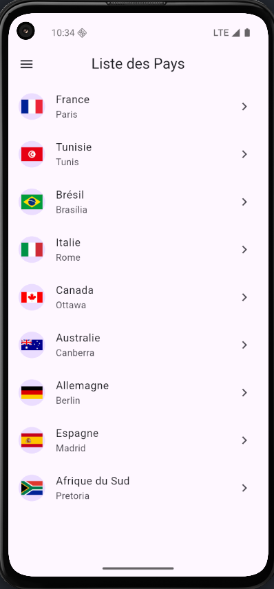

# Atlas Geographic

Small Flutter sample application for a practical exam. It shows a list of countries and includes navigation pages: a welcome screen, a countries list, a country detail page, and an About page.

## Preview

Welcome (landing image):


Example flags (images under `assets/flags/`):

  

## Main files

- `lib/main.dart` : application entry point (starts on `WelcomePage`).
- `lib/welcome_page.dart` : welcome screen with AppBar "Atlas Géographique", landing image (`assets/globe.png`) and "Explore" button that opens the countries list.
- `lib/countries_page.dart` : countries list with AppBar "Liste des Pays", Drawer (Home / About / Quit) and a `ListView` of countries.
- `lib/country_detail_page.dart` : country detail page (AppBar with back button + country name, large flag, capital, population, area, official language).
- `lib/about_page.dart` : About page
- `lib/home_page.dart` : placeholder HomePage
- `lib/models/country.dart` : `Country` data model with attributes: `name`, `capital`, `population`, `area`, `languages`, `flag`.

## Assets structure

The project uses local assets:

- `assets/globe.png` — welcome image
- `assets/flags/...` — flag images (fallback to emojis is also supported)

Make sure assets are declared in `pubspec.yaml` under the `flutter:` section, for example:

```yaml
flutter:
  assets:
    - assets/globe.png
    - assets/flags/
```

## Important notes about asset errors

Follow this checklist:

1. Verify the file actually exists at that path in the repository (case-sensitive file names and extensions).
2. Verify `pubspec.yaml`: the `assets:` section must be indented under `flutter:` (2 spaces).
3. After editing `pubspec.yaml`, run `flutter pub get`.
4. Fully restart the running app. Hot reload does not always pick up new assets.
5. Avoid using spaces or special characters in filenames.

## How to run

From the project root (`atlas_geo_osama`) run:

```bash
flutter pub get
flutter run
```

## Navigation and behavior

# Atlas Geographic

Small Flutter sample application for a practical exam. It shows a list of countries and includes navigation pages: a welcome screen, a countries list, a country detail page, and an About page.

## Preview

Welcome (landing image):


Example flags (images under `assets/flags/`):

   

## Main files

- `lib/main.dart` : application entry point (starts on `WelcomePage`).
- `lib/welcome_page.dart` : welcome screen with AppBar "Atlas Géographique", landing image (`assets/globe.png`) and "Explore" button that opens the countries list.
- `lib/countries_page.dart` : countries list with AppBar "Liste des Pays", Drawer (Home / About / Quit) and a `ListView` of countries.
- `lib/country_detail_page.dart` : country detail page (AppBar with back button + country name, large flag, capital, population, area, official language).
- `lib/about_page.dart` : About page.
- `lib/home_page.dart` : placeholder HomePage.
- `lib/models/country.dart` : `Country` data model with attributes: `name`, `capital`, `population`, `area`, `languages`, `flag`.

## Assets structure

The project uses local assets:

- `assets/globe.png` — welcome image
- `assets/flags/...` — flag images (fallback to emojis is also supported)

Make sure assets are declared in `pubspec.yaml` under the `flutter:` section, for example:

```yaml
flutter:
  assets:
    - assets/globe.png
    - assets/flags/
```

## Important notes about asset errors

If you see messages like:

```
Unable to load asset: "assets/flags/brazil-flag-png-large.png"
```

Follow this checklist:

1. Verify the file actually exists at that path in the repository (case-sensitive file names and extensions).
2. Verify `pubspec.yaml`: the `assets:` section must be indented under `flutter:` (2 spaces).
3. After editing `pubspec.yaml`, run `flutter pub get`.
4. Fully restart the running app. Hot reload does not always pick up new assets.
5. Avoid using spaces or special characters in filenames.

## How to run

From the project root (`atlas_geo_osama`) run:

```bash
flutter pub get
flutter run
```

## Navigation and behavior

- On the welcome screen (`WelcomePage`), the "Explore" button opens `CountriesPage`.
- On `CountriesPage`, the Drawer -->
  - "Home": returns to `WelcomePage` (pushAndRemoveUntil).
  - "About": opens `AboutPage`.
  - "Quit": shows a dialog and exits the app via `SystemNavigator.pop()` when confirmed.
- Tapping a country in the list opens `CountryDetailPage` which displays detailed country information.

## `Country` data model

The model is in `lib/models/country.dart` and looks like:

```dart
class Country {
  final String name;
  final String capital;
  final int population; // number of inhabitants
  final int area; // km2
  final String languages;
  final String flag; // emoji or asset path

  const Country({
    required this.name,
    required this.capital,
    required this.population,
    required this.area,
    required this.languages,
    required this.flag,
  });
}
```

## Quick troubleshooting

- "Unable to load asset": see the "Assets structure" section above. Check spelling, indentation in `pubspec.yaml` and run `flutter pub get`.
- For large flag assets confirm they're committed and named without spaces or special chars.

---

If you want, I can:

1. Check and fix `pubspec.yaml` so assets are listed correctly.  
2. Add/optimize a set of flag images under `assets/flags/` and update `pubspec.yaml`.  
3. Run `flutter analyze` and fix detected warnings/errors.

Tell me which option you prefer and I will proceed.